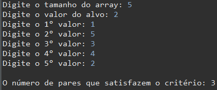

# TERCEIRO DESAFIO

Dado um array de inteiros e um valor alvo, determine o número de pares entre os elementos
do array em que a sua diferença seja igual ao valor alvo.

## Exemplo
K = 1
arr = [1,2,3,4]
Existem 3 valores cuja diferença é igual ao valor alvo K: 2-1 = 1, 3-2 = 1, 4-3 = 1.

## Descrição do problema:
Os pares têm os seguintes parâmetros:
int k: Um Inteiro, valor alvo.
int arr[n] : Um array de Inteiros.

## Retorno
int: O número de pares que satisfazem o critério.

## Formatos de Entrada
Seu código deve conter duas entradas n e k, que representam o tamanho do array e o valor
alvo.
Seu código deve conter um array de inteiros, de tamanho n.

## Resultado
